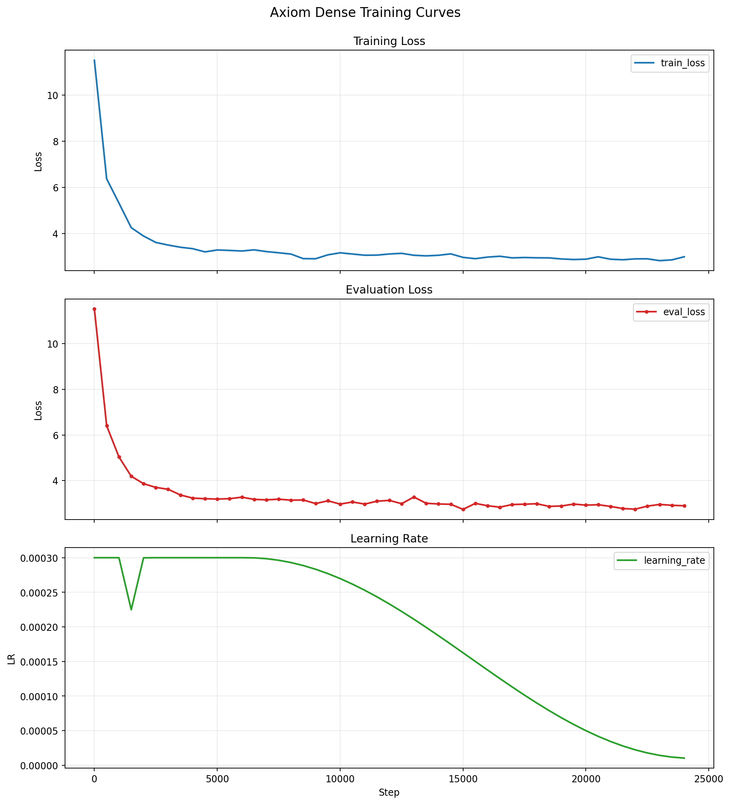

<p align="center">
  
</p>

---

<h2 align="center">
Pretraining a 380M parameter Language Model on an RTX 4070
</h2>

<p align="center">
  <a href="https://huggingface.co/user-anto/Axiom-Dense-380M-Base"></a>
  
  
  
</p>

<br>

## Axiom

This project is about building a language model from scratch, training it at scale on web text, debugging failure modes (like CUDA-OOM, overfitting, repetition loops), and packaging it for reproducible use.

**Axiom Dense 380M** is a full-stack training project:

- Decoder-only Transformer implementation in PyTorch
- Deterministic packed-data pipeline for long training runs
- Practical training loop with resume logic, checkpoint retention, eval tracking, and telemetry
- Inference CLI and chat interface
- Training visualization and experiment tracking workflow

<br>

## What Was Built

### 1) Model Architecture (`model.py`)

- 24-layer dense decoder-only Transformer
- Hidden size 1024
- 16 attention heads with GQA (`n_kv_heads=8`)
- RoPE positional encoding
- RMSNorm + SwiGLU feedforward blocks
- Tied token embedding / output head weights

Parameter count: **385,849,344**.

### 2) Tokenization (`tokenizer.py`)

- `tiktoken` `cl100k_base` vocabulary
- Vocab size: **100,277**
- Explicit EOS handling in data pipeline

### 3) Data Pipeline (`data.py`)

- FineWeb-Edu dataset loading from local disk snapshot
- Optional one-time packing to `uint32` binary token files
- Deterministic train/val split via hash-based row assignment
- Resumable packed token loader for efficient long runs

### 4) Training System (`train.py`)

- Gradient accumulation for effective large-token steps on constrained VRAM
- AdamW / AdamW8bit optimizer support
- Warmup + cosine decay schedule
- Automatic checkpointing and interrupt-safe saves
- Eval loop with perplexity tracking
- Metric CSV outputs for training diagnostics

### 5) Inference (`chat.py`, `cli.py`)

- Interactive local generation for quick testing
- Streaming response mode in chat CLI
- Decoding controls for repetition mitigation

<br>

## Training Snapshot

From the current configuration and logs:

- Target training tokens: **8.0B**
- Effective tokens per optimizer step: **327,680**
- Planned optimizer steps: **24,414**
- Best recorded eval loss: **2.7394** (step 15,000)
- Best recorded eval perplexity: **15.4780** (step 15,000)
- Final logged eval loss: **2.8972** (step 24,000)
- Final logged eval perplexity: **18.1233** (step 24,000)

These metrics are from internal validation on the project split and should be treated as developmental indicators, not benchmark SOTA claims.

<p align="center">
  
</p>

<br>

## Repository Layout

```text
.
├── model.py            # Transformer architecture
├── config.py           # Model + training hyperparameters
├── data.py             # Dataset loading, packing, and loaders
├── train.py            # Main pretraining script
├── tokenizer.py        # tiktoken wrapper and EOS helpers
├── chat.py             # Interactive chat CLI (base model)
├── cli.py              # Base-checkpoint inference CLI
├── CLI.md              # CLI argument reference
├── vis.py              # Train/eval/lr curve plotting utility
├── train_metrics.csv   # Training telemetry history
├── eval.csv            # Eval loss/perplexity history
├── training_curves.png # Generated training visualization
└── imp_ckpts/        # Training checkpoints
```

<br>

## Quick Start

### Environment

```bash
python3 -m venv .venv
source .venv/bin/activate
pip install -U pip
pip install torch datasets tiktoken python-dotenv safetensors huggingface_hub
```

### Train

```bash
python3 train.py
```

### Chat Locally

```bash
python3 chat.py --ckpt checkpoints/step_0024414.pt --stream
```

### Visualize Training

```bash
python3 vis.py --train-csv train_metrics.csv --eval-csv eval.csv --out training_curves.png
```

<br>

## Tooling Docs

- CLI options reference: [`CLI.md`](./CLI.md)
- Visualization utility: [`vis.py`](./vis.py)

<br>

## Hugging Face Usage

Model:

```python
from transformers import AutoTokenizer, AutoModelForCausalLM

repo = "user-anto/Axiom-Dense-380M-Base"
tok = AutoTokenizer.from_pretrained(repo, trust_remote_code=True)
model = AutoModelForCausalLM.from_pretrained(repo, trust_remote_code=True)
```

<br>

## Design Decisions and Tradeoffs

- **Why 380M scale?** Big enough to surface real pretraining dynamics, small enough to iterate independently.
- **Why packed token binaries?** Better throughput, lower tokenization overhead during long runs.

<br>

## Current Limitations

- Base model only (not instruction tuned)
- Context length capped at 1024 tokens
- Evaluation currently internal; broad external benchmarking is pending
- Decoding quality still sensitive to prompt and sampling settings

<br>

## Future Work

- Add supervised instruction tuning stage
- Expand benchmark reporting
- Add longer-context variant
- Add recursive variant
- Improve inference ergonomics and packaging
- Publish reproducible training/eval scripts for one-command replication

<br>
